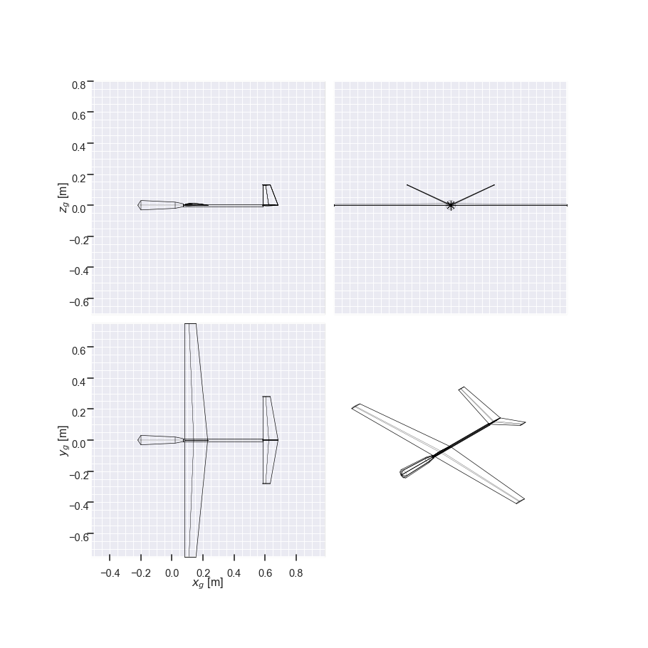
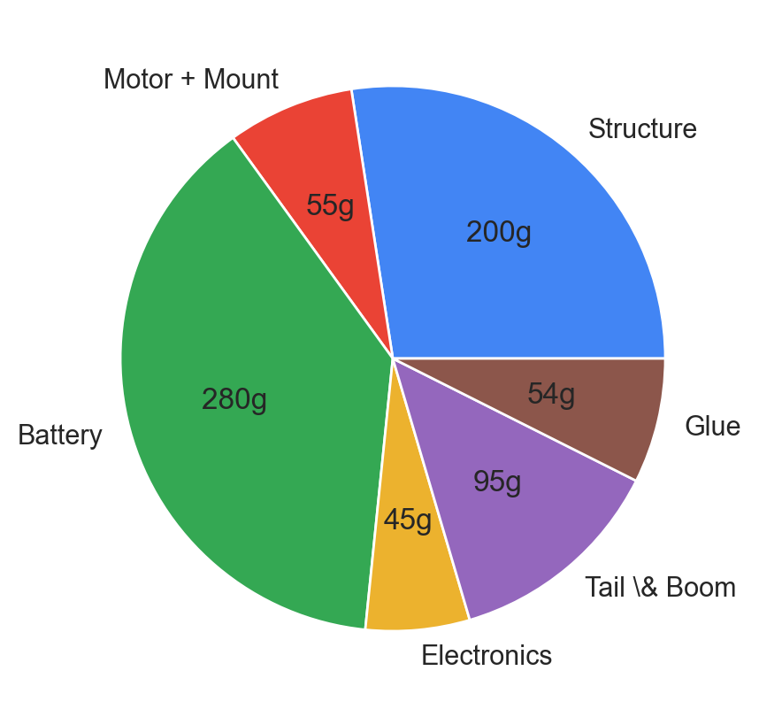
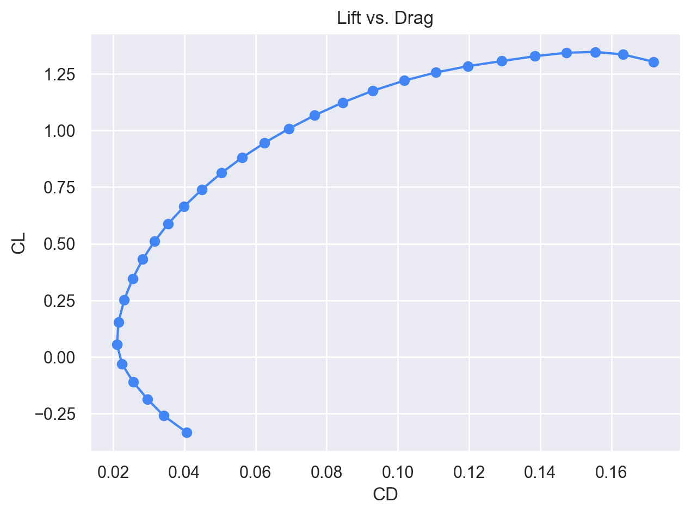
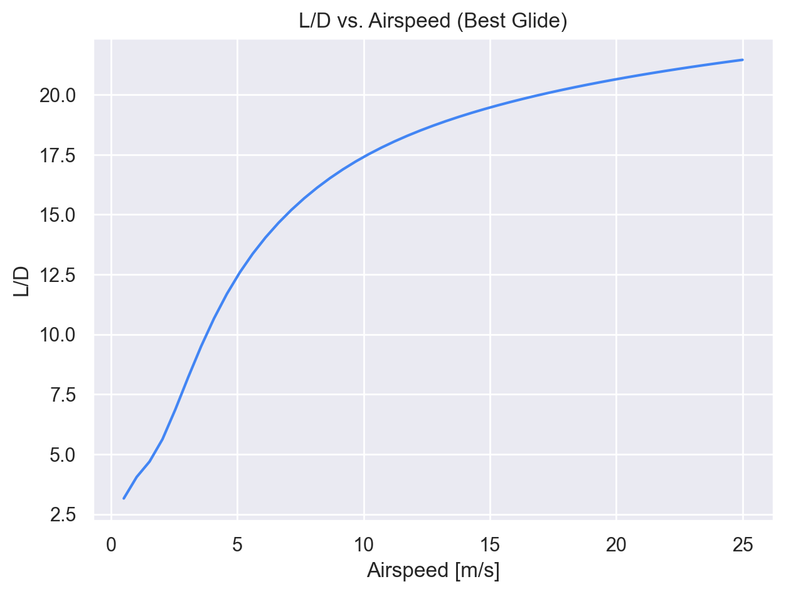
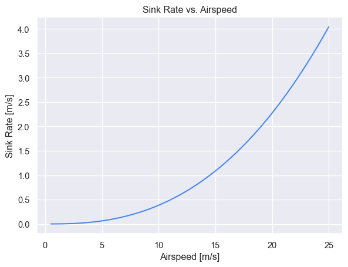

# UAV Design
Gideon Grinberg
2025-07-25

## Introduction

This document outlines the design of the UAV. The design was optimized
using [`AeroSandbox` by Peter
Sharpe](https://github.com/peterdsharpe/AeroSandbox), and the code used
to generate this document is available in the Github repo. The code is
heavily based on Peter’s Feather glider design tool.

## Three-View Plan

``` python
airplane_sol.draw_three_view(show=False, style="wireframe")
p.show_plot(tight_layout=False)
```



## Weight Budget

``` python
mass_components = {
    "Structure": s(mp_struct.mass),
    "Motor + Mount": s(mp_power.mass),
    "Battery": s(mp_batt.mass),
    "Electronics": s(mp_elec.mass),
    "Tail \\& Boom": s(mp_tail.mass),
}

mp_glue = sum(mass_components.values()) * 0.08
mass_components["Glue"] = mp_glue

labels = list(mass_components.keys())
values = [v*1000 for v in list(mass_components.values())] # convert to g

def make_autopct(values, suffix="g"):
    def autopct(pct):
        total = sum(values)
        val = int(round(pct * total / 100.0))
        return f"{val}{suffix}"
    return autopct

plt.figure()
plt.pie(values, labels=labels, autopct=make_autopct(values, "g"))
plt.show()
```



## Flight Characteristics

### Lift vs. Drag

``` python
alphas = np.linspace(-5, 15, 30)
CLs = []
CDs = []

velocity_sol = s(op_point.velocity)
for alpha in alphas:
    op = asb.OperatingPoint(
        velocity=velocity_sol,
        alpha=alpha
    )
    aero = asb.AeroBuildup(
        airplane=airplane_sol,
        op_point=op
    ).run()
    CLs.append(aero["CL"])
    CDs.append(aero["CD"])

plt.figure()
plt.plot(CDs, CLs, marker="o")
plt.xlabel("CD")
plt.ylabel("CL")
plt.title("Lift vs. Drag")
plt.show()
```



### L/D vs. Airspeed (Best Glide)

``` python
speeds = np.linspace(0, 25, 50)
LDs = []

for v in speeds:
    op = op_point.copy()
    op.velocity = v
    aero = asb.AeroBuildup(airplane=airplane_sol, op_point=sol(op)).run()
    LDs.append(aero["L"] / aero["D"])

plt.figure()
plt.plot(speeds, LDs)
plt.xlabel("Airspeed [m/s]")
plt.ylabel("L/D")
plt.title("L/D vs. Airspeed (Best Glide)")
plt.show()
```



### Sink Rate vs. Airspeed

``` python
speeds = np.linspace(0, 25, 50)
sink_rates = []
mass_tot_kg = s(mass_tot.mass)

for v in speeds:
    op = asb.OperatingPoint(
        velocity=v,
        alpha=s(alpha_deg)
    )
    aero = asb.AeroBuildup(airplane=airplane_sol, op_point=op).run()
    power_loss = aero["D"] * v
    sink = power_loss / (mass_tot_kg * 9.81)
    sink_rates.append(sink)

plt.figure()
plt.plot(speeds, sink_rates)
plt.xlabel("Airspeed [m/s]")
plt.ylabel("Sink Rate [m/s]")
plt.title("Sink Rate vs. Airspeed")
plt.grid(True)
plt.show()
```


